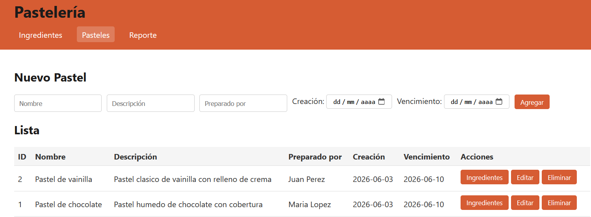
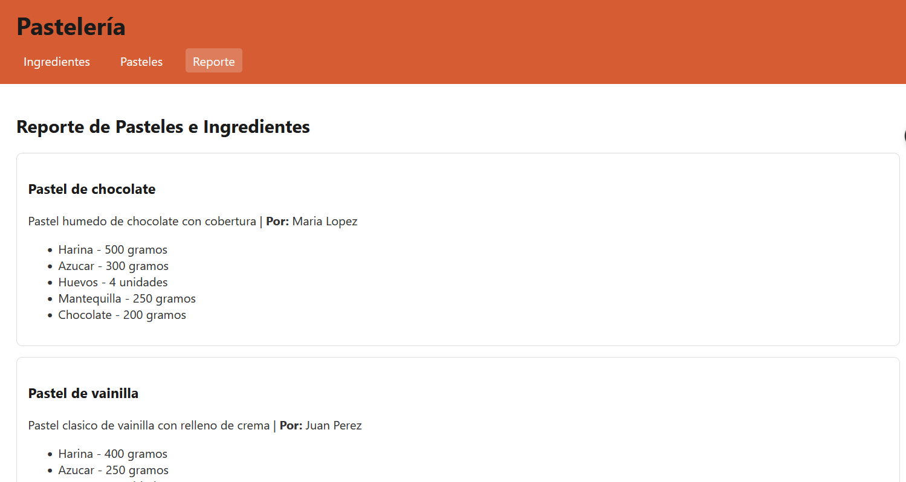

# Pastelería

Aplicación para gestionar pasteles e ingredientes. Permite crear, editar y eliminar registros, asignar ingredientes a cada pastel con su cantidad correspondiente, y consultar un reporte de la información registrada.

## Stack

- Vue 3 con Vite en el frontend
- PHP como API REST
- MySQL / MariaDB para la base de datos
- Apache a través de XAMPP

## Requisitos previos

Antes de clonar el proyecto se necesita tener instalado lo siguiente.

### XAMPP

XAMPP incluye Apache, MySQL/MariaDB y PHP en un solo instalador. Se descarga desde el sitio oficial: https://www.apachefriends.org/

Una vez instalado, se abre el "XAMPP Control Panel". Para este proyecto solo se requieren dos módulos:

- Apache: para que sirva los archivos PHP del backend
- MySQL: para la base de datos

Al presionar "Start" en cada uno, deben mostrar el estado "Running" en color verde. Si alguno no inicia, la causa más común es que otro programa esté ocupando el mismo puerto, por ejemplo, otro servidor MySQL instalado previamente.

### Node.js

Node.js incluye npm, que se utiliza para instalar las dependencias de Vue. Se descarga desde https://nodejs.org/ y se recomienda la versión LTS.

Para verificar que la instalación fue correcta, se abre una terminal y se ejecutan los siguientes comandos:

node -v
npm -v

Deben mostrarse dos números de versión, por ejemplo v20.10.0 y 10.2.3. Si la terminal no reconoce los comandos, se debe reiniciar o reinstalar Node.js.

### Git

Si todavía no se tiene instalado, se descarga desde https://git-scm.com/. Para verificar:

git --version

## Clonar y poner en marcha

### 1. Clonar el repositorio

Se abre una terminal en la carpeta `C:\xampp\htdocs\`, que es donde Apache busca los archivos a servir, y se ejecuta:

git clone https://github.com/h4n00/pasteleria 

Esto crea la carpeta `pasteleria` con todo el código adentro.

### 2. Crear la base de datos

Se inicia Apache y MySQL desde el panel de XAMPP. Después se abre el navegador en la siguiente dirección:
http://localhost/phpmyadmin

Una vez dentro, se hace clic en la pestaña "SQL" y se pega el contenido del archivo `database/pasteleria.sql`. Al presionar "Continuar" o "Go", el script se ejecuta y crea las tres tablas con algunos datos de prueba.

Para verificar, en el panel izquierdo debe aparecer la base de datos `pasteleria` con las tablas `pastel`, `ingrediente` y `pastel_ingrediente`.

### 3. Levantar el frontend

El backend PHP ya queda servido por Apache de forma automática. El frontend Vue sí requiere un paso de instalación previo.

Desde la terminal se ingresa a la carpeta del frontend:

cd pasteleria/frontend

Se ejecuta el siguiente comando para instalar las dependencias: npm install

Este proceso descarga todas las dependencias necesarias como Vue, Vite, axios y otras. La instalación puede tardar entre 30 segundos y 2 minutos según la velocidad de conexión.

Cuando termina, se levanta el servidor de desarrollo con:  npm run dev

La consola mostrará una salida similar a:
VITE v5.0.0  ready in 350 ms
Local:   http://localhost:5173/
Al abrir esa URL en el navegador, la aplicación queda funcionando.

## Estructura del proyecto
pasteleria/
-backend/  
--- conexion.php
---ingredientes.php
---pasteles.php
---pastel_ingredientes.php
---reporte.php
-frontend/     Aplicación Vue
--src/
---App.vue
---main.js
--composables/
---useCrud.js
--router/
---index.js
--views/
---IngredientesView.vue
---PastelesView.vue
---PastelDetalleView.vue
---ReporteView.vue
--package.json
--vite.config.js
--database/
---pasteleria.sql
--screnshot/
La carpeta `node_modules/` no se incluye en el repositorio por su tamaño y porque se regenera con `npm install`. Por esta razón es importante ejecutar ese comando después de clonar.

## Sobre el modelo

El modelo está compuesto por tres tablas: `pastel`, `ingrediente` y `pastel_ingrediente`. Esta última es la tabla intermedia que vincula pasteles con ingredientes, y almacena la cantidad y unidad de medida correspondiente, como gramos, ml o unidades.

Las llaves foráneas tienen un comportamiento intencional. Si se elimina un pastel, sus relaciones se borran en cascada. Por otro lado, no se permite eliminar un ingrediente que todavía esté en uso por algún pastel, con el fin de proteger la integridad de los datos.

## Comunicación entre las partes

El frontend Vue corre en el puerto 5173. Cuando se realiza una acción en la interfaz, axios envía una petición HTTP al backend PHP, que se ejecuta bajo Apache en el puerto 80. PHP procesa la petición, consulta la base de datos en MariaDB sobre el puerto 3306, construye una respuesta en formato JSON y la devuelve al frontend.

## Capturas

